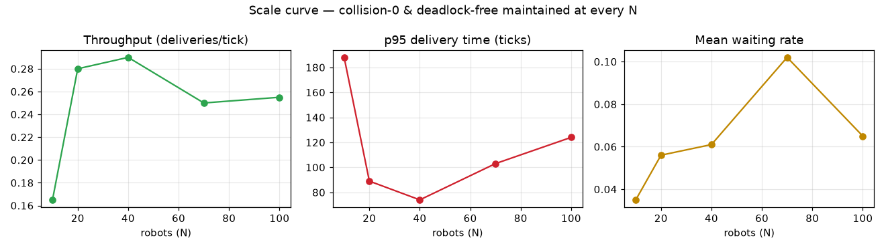
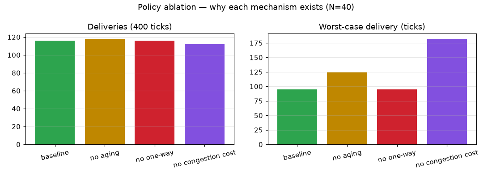

# mini FMS — 다중 로봇 창고 조율 시뮬레이터

**결정론적 다중 에이전트 경로조율(MAPF-style) 시뮬레이터 + 실시간 관제 대시보드.**
순수 파이썬(코어 신규 의존성 0) · 시드 결정론 · 정점+간선 충돌 0 불변식 · 골든-궤적 회귀 게이트.

> A deterministic multi-agent path coordination (MAPF-style) simulator with a live monitoring dashboard.
> Grid-abstracted warehouse fleet: A\* planning, collision/deadlock resolution, task allocation, fault self-healing, and observability — all as pure, seed-deterministic functions guarded by a frame-level golden regression gate.

---

## 무엇인가 (정직한 범위)

38×27 격자 창고에서 **로봇 40대**가 물류(rack 픽업 → dock 배송)를 끝없이 처리하는 시뮬레이터입니다. 다중 로봇 **조율 로직**(경로계획·충돌회피·교착해소·작업할당·fleet 상태관리)에 집중하며, 다음은 **의도적으로 추상화**했습니다:

- **연속 물리·동역학 없음** — 로봇은 1 tick에 셀→셀 이동(motion planning이 아니라 **graph search/경로계획**).
- **ROS2·센서·인지 없음** — 위치는 완전 관측, 통신 실패는 tick-heartbeat로 추상화(결정론 확보용).
- **충돌 0은 이산 예약 스킴의 보장** — 연속 footprint·불확실성 있는 실제 로봇엔 그대로 적용되지 않음.

즉 로보틱스 스택에서 **조율/오케스트레이션 층**을 손으로 구현한 것이며, 물리·sim2real 층은 범위 밖입니다.

## 실제 로보틱스 스택과의 대응

| 이 프로젝트 | 실제 대응 |
|---|---|
| A\* + 혼잡 비용(`_congestion`) | ROS2 **Nav2** global planner + costmap |
| fleet 루프 + 작업할당(`coordinator`) | ROS2 **Open-RMF** fleet adapter |
| soft one-way 통로 방향잠금 | 창고 AMR 일방통행 트래픽 관리 |
| claim-heartbeat 고장 파생 | fleet 상태 모니터링(단, 실제는 벽시계·타임아웃) |

## 핵심 기능

- **경로계획**: A\*(4-연결, 맨해튼, 결정론 tie-break) + 혼잡 비용으로 우회 분산.
- **충돌회피**: 보수적 셀 예약으로 **정점+간선(swap) 충돌 0** 매 tick 불변식.
- **교착해소(계층)**: soft one-way 통로 방향잠금 → bay 양보 → 혼잡 회피 재경로 → wait-for 사이클 감지. 진동(oscillation)은 hysteresis·우선순위 하향으로 억제.
- **기아 방지(aging)**: 대기가 길어진 배송이 이동 선점 상승 → 최장 배송 소요 단축(실측 수치는 `python scenario_selfcheck.py`의 `[기아방지]` 출력이 단일 진실원 — aging 끔/켬 대조로 매 실행 검증).
- **고장 자가치유**: claim-heartbeat로 침묵 로봇을 down 파생 → 태스크 재배분 → 회복(towed). 도달불가 태스크는 "개입 필요"로 정직하게 차단.
- **관제 대시보드**: 2D 격자 렌더 · 통로 방향 화살표 · 차단 개입큐 · 처리량 시계열 · 로봇 드릴다운 · **자동주행 결정 트레이스(flight recorder, `/trace.jsonl`)**.

## 엔지니어링 규율

- **순수함수 + 시드 결정론**: `step(world) → (world', telemetry, events)`, 입력 불변. 텔레메트리는 출력이지 되먹임 아님.
- **골든-궤적 회귀 게이트**: 핵심 시나리오의 tick별 `(id,pos)` 시퀀스를 SHA256으로 동결 → 코어 리팩터가 궤적을 바꾸면 즉시 감지(`ticks==ticks2`가 못 잡는 경로 드리프트까지).
- **비-동어반복 셀프체크 16종**: "원인 주입 → 시스템이 결과 파생 → selfcheck가 파생을 assert"(예: aging on/off 대조군, 혼잡 유무로 재경로 인과 분리).
- **신규 pip 의존성 0** — 코어는 stdlib(`heapq`), 웹만 fastapi/uvicorn.

## 실행

```bash
# 관제 서버 + 라이브 시뮬 (브라우저: http://127.0.0.1:8820)
python run.py

# 셀프체크(서버 불필요)
python scenario_selfcheck.py    # 16종: 골든게이트·충돌0·교착·기아방지·현업규모·연속물류·주행트레이스
python selfcheck.py             # M1 A*·순수성·결정론
python test_e2e.py              # HTTP 파이프라인 + 드릴다운
```

대시보드 상단 컨트롤: 실행 속도(1/2/4/8×), 로봇 라벨(번호/우선순위), 로봇 클릭 → 상세 드릴다운.

## 파일 구성

- `gridmap.py` — 격자 창고 맵·물류 지점(rack/dock)·분산 배치
- `planner.py` — A\* 경로계획(혼잡 비용 옵션)
- `sim.py` — 순수함수 `step()`·충돌회피·교착해소·통로 방향잠금·aging
- `coordinator.py` — 작업할당·2단 여정·고장 자가치유·연속 운영 루프
- `run.py` — 라이브 데모(40대·끝없는 물류) + 관제 서버 기동
- `app.py` — FastAPI 대시보드(canvas 렌더·집계 지표·flight recorder)
- `store.py` — SQLite 텔레메트리 시계열
- `scenario_selfcheck.py` · `selfcheck.py` · `test_e2e.py` — 검증

## 실험·평가 (`python experiments.py` — 결정론, 2회 재실행 동일 assert)



- **스케일 곡선**: 처리량이 **N=40 부근에서 포화** — N=10~20은 공급 부족, N=70+는 혼잡 병목(대기율 10%+)으로 로봇을 더 넣어도 처리량이 하락. 모든 N에서 충돌 0·정상 종료 유지(매 tick assert).



- **정책 ablation**(하나씩 끄고 측정): **aging 끔 → 최악 배송 95→124t**(aging은 평균이 아니라 꼬리/공정성을 사는 메커니즘) · **혼잡비용 끔 → 최악 182t**(같은 우회로 쏠림) · **one-way**는 정상 운영에선 무발동(정직), 3중 반쪽폐쇄 스트레스에서 **완료율 72 vs 58(Δ+14)** — 교착 예방의 fleet 가치.
- **Negative results**: 긴급/반납 이동 우선순위 부스트 2건은 실측에서 무-교착 불변식을 깨(도달 가능한 태스크 7건/2건 교착) 반려 — 우선 처리는 할당 계층까지, 이동 계층은 aging-공정 유지가 무-교착 경계선.
- 상세: `docs/mini-fms_실험결과_20260716.md`(physical-ai-lab).

## 알려진 한계 (정직하게)

- 이산 격자·완전관측·1-tick 이동 — 연속 모션플래닝·상태추정·제어는 미포함.
- soft one-way·bay 양보·aging·wait-for 교착감지는 창고 로보틱스의 **표준 기법**(재발명이며, 가치는 직접 유도·구현·테스트로 검증한 점).
- 반응형 조율의 한계: 물리적으로 통행 가능한 경합은 전부 해소하되, 병리적 1-wide 병목은 "개입 필요"로 차단(정직).
- 우선순위: bay 양보 시 값이 팽창(상대순서·동작은 정확, 표시값만 커짐 — 업그레이드 경로는 코드 주석 참조). 긴급은 **할당 우선**만 — 이동까지 부스트하면 aging 기아방지/무-교착 불변식과 충돌하므로 의도적 결정.
